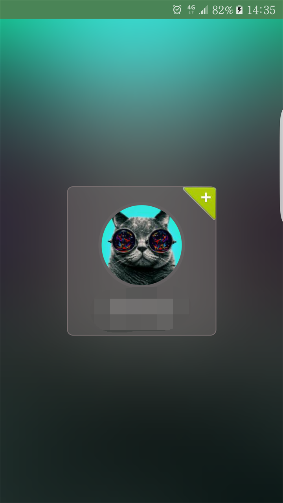
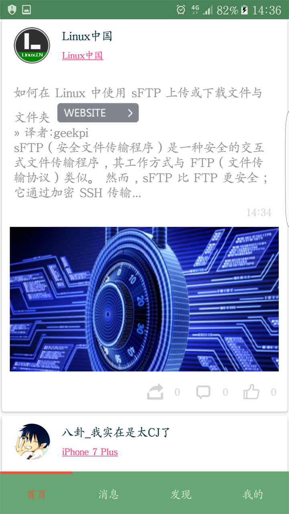
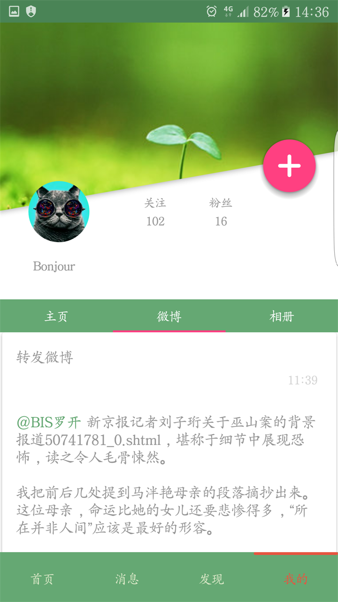
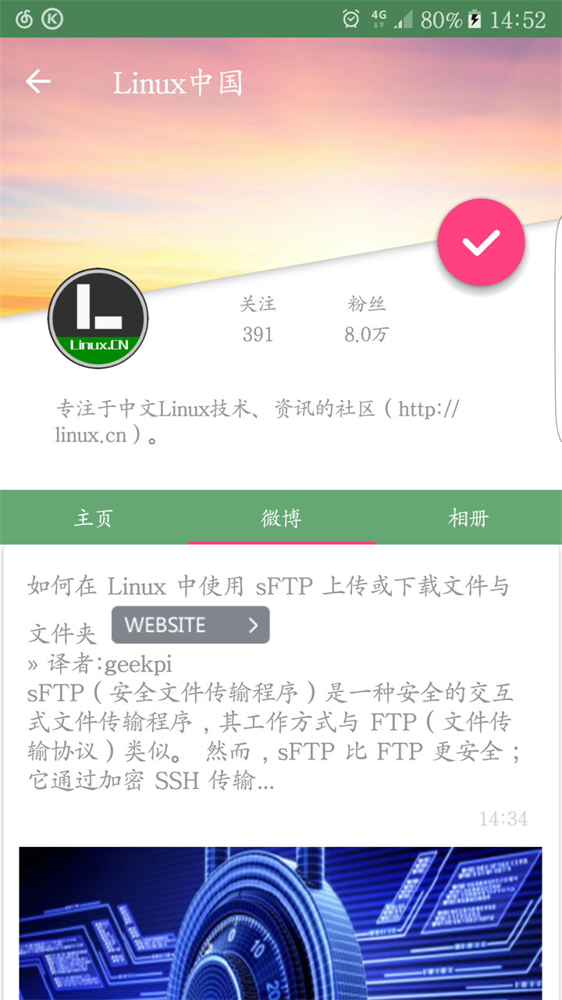
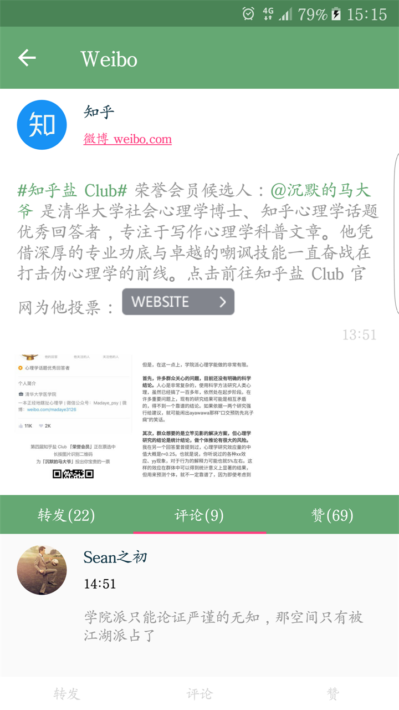
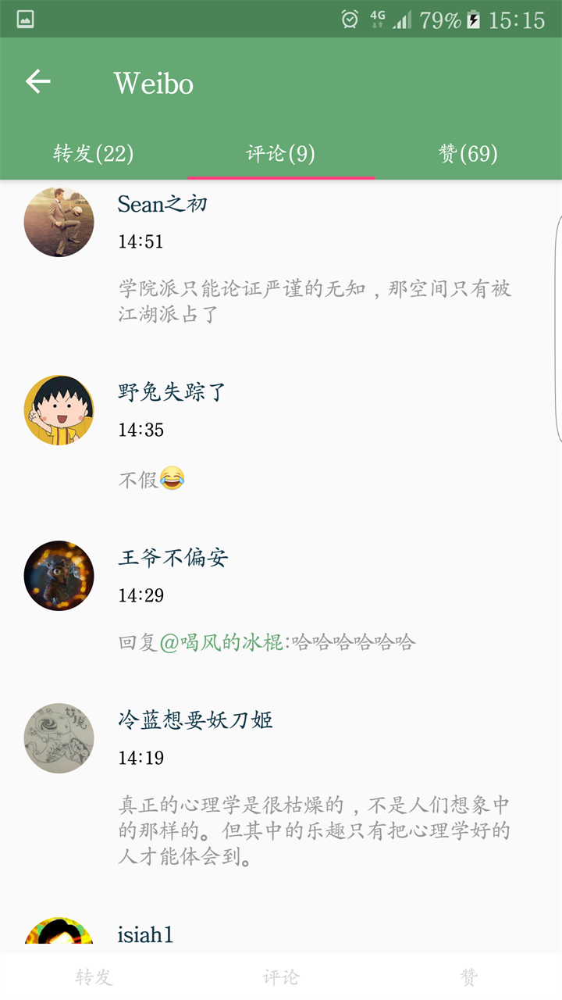
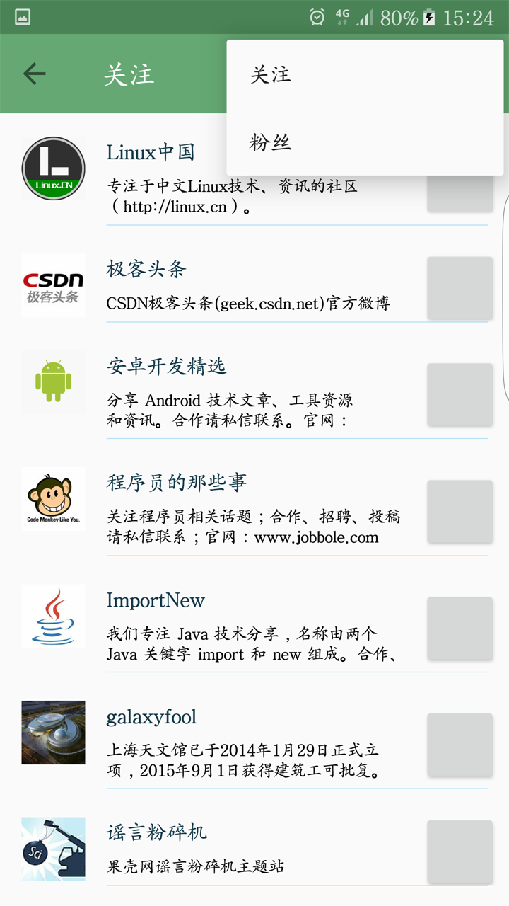
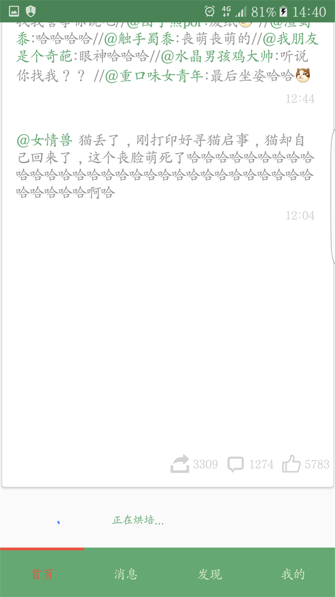
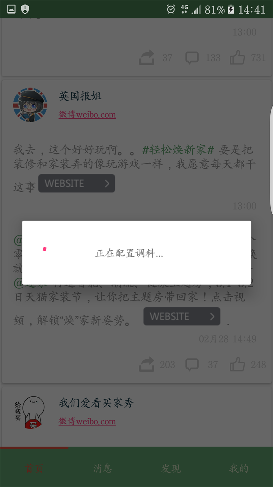

# MaterialDesignWeibo

Material Design风格的微博客户端，可以使用大部分和新浪微博相似的功能，但某些功能因为新浪接口限制不能使用。 
使用第3方网站解析了一些视频网站的源地址，直接可以用内置播放器播放，不用跳转到网页播放视频（在64位系统上不能使用）。 
视频链接解析为第3方提供，所以仅用于学习交流，不可用于商业用途，如有侵权告知删除。

###View
####登录

####首页

####我的

####用户信息

####微博信息

####评论

####关注用户（灰色方块为未做好的关注或取消关注按钮）

####使用'正在烘焙'和'正在配置调料'代替'正在加载'

###被限制的接口
####不能使用的
热门微博：评论最多，转发最多 
####有时可以使用
用户的个人微博查询 
未关注用户查询 
#####如果你哪天发现没有数据，不用急着找代码bug，有可能是接口限制了

#### License ####

	Copyright 2016 ckenergy <2ckenergy@gmail.com>
    Licensed under the Apache License, Version 2.0 (the "License");
    you may not use this file except in compliance with the License.
    You may obtain a copy of the License at

       http://www.apache.org/licenses/LICENSE-2.0

    Unless required by applicable law or agreed to in writing, software
    distributed under the License is distributed on an "AS IS" BASIS,
    WITHOUT WARRANTIES OR CONDITIONS OF ANY KIND, either express or implied.
    See the License for the specific language governing permissions and
    limitations under the License.

